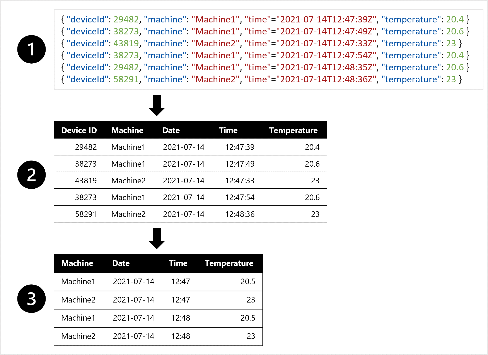

# Design a Data Ingestion Strategy for Machine Learning Projects

Data is the foundation of machine learning. Both **data quantity** and **data quality** impact the model’s accuracy. Before training a machine learning model, identify data sources and the tools required to load and transform data.

## Learning Objectives
- Identify your **data source** and **format**.
- Choose how to serve data to machine learning workflows.
- Design a data ingestion solution.

---

## I. Identify Your Data Source and Format

### Machine Learning Workflow
1. **Define the problem**: Decide on the prediction objective and success criteria.
2. **Get the data**: Identify sources and ensure access.
3. **Prepare the data**: Explore, clean, and transform data.
4. **Train the model**: Use trial-and-error to select an algorithm and hyperparameters.
5. **Integrate the model**: Deploy for predictions.
6. **Monitor the model**: Track performance.

### Extract, Transform, Load (ETL/ELT) Process
- **Extract** data from its source.
- **Transform** data to meet model requirements.
- **Load** data into a serving layer for machine learning workflows.

### Data Source
- Sources include **CRM systems**, **SQL databases**, and **IoT devices**.
- If data is unavailable, collect new data, acquire public datasets, or purchase curated datasets.

### Data Format
- **Structured data** (e.g., tables, CSV files).
- **Semi-structured data** (e.g., JSON).
- **Unstructured data** (e.g., images, videos).

#### Example Transformation
- Extract JSON data from an IoT device.
- Convert JSON to a table.
- Aggregate temperature readings per hour for predictive maintenance.

---

## II. Choose How to Serve Data to Machine Learning Workflows

### Separate Compute from Storage
- **Benefits**: Minimize costs and maximize flexibility.
- Store data in separate tools to avoid loss when compute is shut down.

### Azure Storage Options
1. **Azure Blob Storage**
   - Cheapest option for unstructured data (e.g., JSON, CSV).
   - Suitable for storing images and text.

2. **Azure Data Lake Storage (Gen 2)**
   - Advanced version of Blob Storage with a hierarchical namespace.
   - Virtually unlimited storage for large datasets.

3. **Azure SQL Database**
   - Ideal for structured, static data.
   - Stores data in tables with predefined schemas.

---

## III. Design a Data Ingestion Solution

### Data Ingestion Pipeline
- Automate tasks to move and transform data.
- Use tools like **Azure Synapse Analytics**, **Azure Databricks**, or **Azure Machine Learning**.

#### Tools for Data Pipelines

1. **Azure Synapse Analytics**
   - UI-based or JSON-defined pipelines.
   - Supports standard connectors and data transformations (SQL, Python, R).
   - Compute options: serverless SQL pools, dedicated SQL pools, or Spark pools.

2. **Azure Databricks**
   - Code-first tool with notebooks.
   - Distributed compute using Spark clusters.

3. **Azure Machine Learning**
   - Create pipelines using Designer or scripts.
   - Use scalable compute clusters.
   - Suitable for integrated workflows but may not scale as efficiently as Synapse or Databricks.

#### Example Architecture
1. Extract raw data from its source (e.g., CRM or IoT device).
2. Transform data using **Azure Synapse Analytics**.
3. Store prepared data in **Azure Blob Storage**.
4. Train the model with **Azure Machine Learning**.

---

## Knowledge Check

1. **What is the type of data extracted as JSON objects from an IoT device?**
   - [ ] Tabular data  
   - [x] Semi-structured data  
   - [ ] Unstructured data  

2. **Which data store is best for storing transformed CSV files?**
   - [ ] Azure SQL Database  
   - [ ] Azure Blob Storage  
   - [x] Azure Data Lake Storage (Gen 2)  

---

## Resources
- [Select an Azure Data Store for Your Application](https://learn.microsoft.com/en-us/azure/architecture/guide/technology-choices/data-store-decision-tree)
