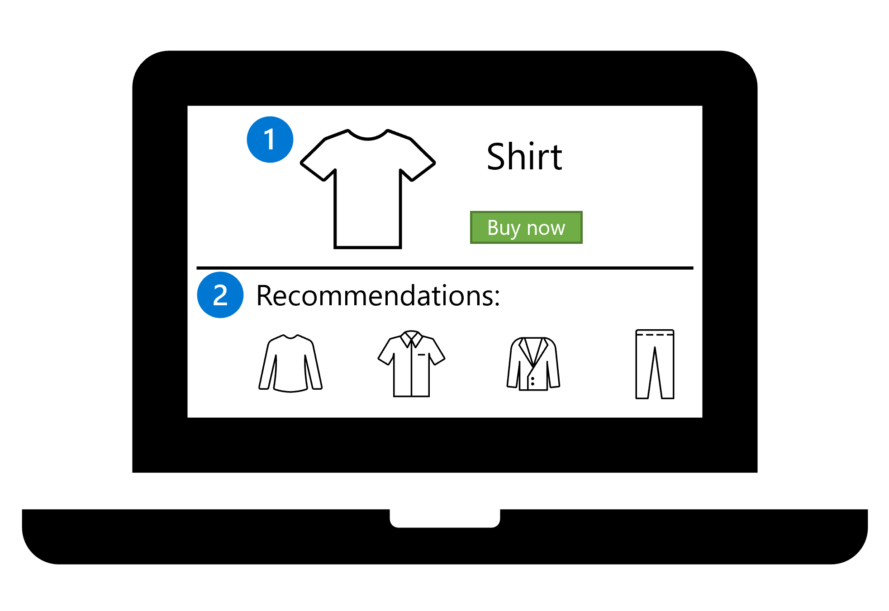
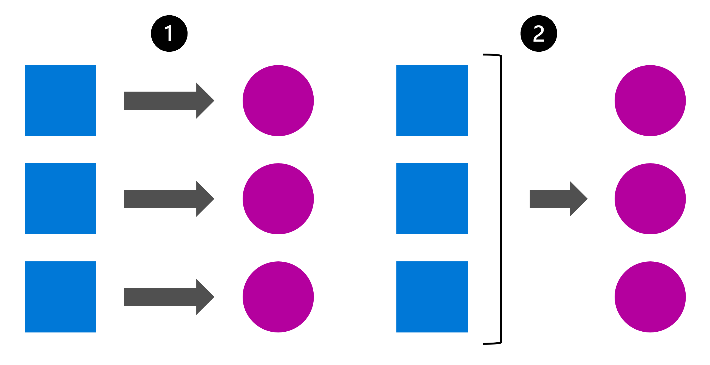

# Design a Model Deployment Solution

## I. Understand How the Model Will Be Consumed

You should plan how to integrate the model, as this affects how you train the model and the data you use. To integrate the model, you can deploy it to an endpoint for either **real-time** or **batch predictions**.

### Deploy a Model to an Endpoint
Deploying a model to an endpoint allows applications to call the model for predictions via a web address.

#### Options:
- **Real-time predictions**
- **Batch predictions**

#### Get Real-time Predictions
Real-time predictions are ideal when the model needs to score new data immediately, such as:

1. A customer selects a product on a website (e.g., a shirt).
2. The model recommends related items instantly.

#### Get Batch Predictions
Batch predictions are used when predictions are generated and stored as files or in a database for later use. For example:

- Predicting weekly orange juice sales based on collected sales data.

---

## II. Decide on Real-time or Batch Deployment
The decision depends on:
- Frequency of predictions.
- Timeliness of results.
- Whether predictions are individual or in batches.
- Compute cost.

### Identify the Necessary Frequency of Scoring
Two common scenarios:
1. **Real-time predictions**: Predictions are needed immediately as new data is collected.
2. **Batch predictions**: Predictions are scheduled based on collected data over time.

### Decide on the Number of Predictions
- **Individual predictions**: A single row of data is scored.
- **Batch predictions**: Multiple rows of data are scored, and results are returned as a batch.

### Consider the Cost of Compute
- **Real-time endpoints**: Require always-on compute, e.g., Azure Container Instance (ACI) or Azure Kubernetes Service (AKS). Costs are continuous.
- **Batch endpoints**: Use compute clusters that scale dynamically based on workload. Costs are minimized when idle.

### Deployment Strategy Summary
- **Real-time predictions**: Immediate, individual predictions. Suitable for applications needing instant results but involves continuous costs.
- **Batch predictions**: Processed when data is available. Cost-effective for less time-sensitive scenarios.

If a 5-10 minute delay is acceptable, batch predictions with on-demand compute clusters may be a better choice.

### Factors to Consider:
- Simpler models require less compute and cost.
- Complex models need more compute and processing time.

---

## Knowledge Check

1. **What type of predictions are needed by the mobile application?**
   - [x] Real-time predictions: Correct. Immediate predictions are required for individual patients.
   - [ ] Batch predictions
   - [ ] Local predictions

2. **What kind of compute should be used by the deployed model?**
   - [ ] Virtual machines
   - [x] Containers: Correct. Containers are cost-effective for always-available models.
   - [ ] Local device
