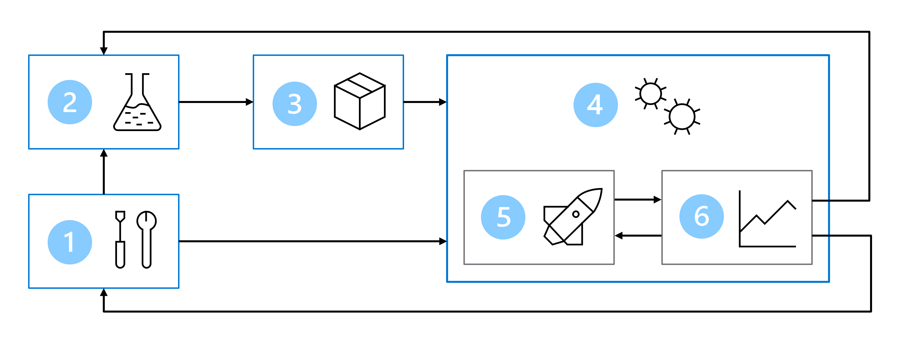
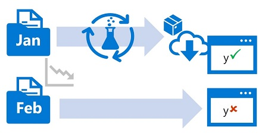

## Design a Machine Learning Operations Solution

### I. Explore an MLOps Architecture

As a data scientist, your goal is to train the best machine learning model, deploy it to an endpoint, and integrate it with an application. Over time, you may need to retrain the model when new data is available. To operationalize the model:

- Convert the model training to a robust and reproducible pipeline.
- Test the code and model in a development environment.
- Deploy the model in a production environment.
- Automate the end-to-end process.

#### Set Up Environments for Development and Production

- **Environment**: A collection of resources used to deploy a model or application.
- Common environments:
  - **Development (Dev)**: Experiment with model training.
  - **Staging/Pre-Production (Pre-Prod)**: Deploy and test the model.
  - **Production (Prod)**: Deploy the model for end-users.

#### Organize Azure Machine Learning Environments

- Best practice: Separate environments for different stages (e.g., Dev, Pre-Prod, Prod).
- Use **Role-Based Access Control (RBAC)** to manage access to Azure resources.
- Alternatively, use one workspace for Dev and Prod to reduce management overhead, though RBAC applies to both environments.

#### Design an MLOps Architecture

- **Key Components**:
  1. Setup: Create necessary Azure resources.
  2. Model development (Inner Loop): Train and evaluate models.
  3. Continuous Integration: Package and register models.
  4. Model deployment (Outer Loop): Deploy models.
  5. Continuous Deployment: Test and promote models to production.
  6. Monitoring: Track model and endpoint performance.

### II. Design for Monitoring

#### Monitor the Model

- Evaluate performance metrics (e.g., accuracy, fairness).
- Use **MLflow** to train and track models.
- Monitor new predictions with performance benchmarks to detect degradation.

#### Monitor the Data

- Detect **data drift**: Changes in data profiles that impact model accuracy.
- Example: Training data vs. current data profiles for predicting car mileage.

#### Monitor the Infrastructure

- Optimize compute usage to minimize costs.
- Review compute utilization during training and deployment to scale resources efficiently.

### III. Design for Retraining

#### Retraining Approaches

- **Schedule-based**: Retrain periodically (e.g., weekly, monthly).
- **Metrics-based**: Retrain when performance metrics or data drift indicate.

#### Prepare Your Code

- Use **scripts** (notebooks are less suitable for automation).
- Add **parameters** to scripts for flexibility (e.g., training data, hyperparameters).
- Host code in a **central repository** (e.g., Git-based) for source control and collaboration.

#### Automate Your Code

- Use **Azure Machine Learning jobs** to execute scripts.
- Automate with **pipelines** in Azure Machine Learning.
- Trigger pipelines using external tools like **Azure DevOps** or **GitHub Actions**.
- Prefer the **Azure CLI** for automating tasks in external tools.

### Resources

- [Best practices to organize Azure Machine Learning resources](https://learn.microsoft.com/en-us/azure/cloud-adoption-framework/ready/azure-best-practices/ai-machine-learning-resource-organization)
- [Introduction to Machine Learning Operations (MLOps)](https://learn.microsoft.com/en-us/training/paths/introduction-machine-learn-operations/)
- [MLOps Automation Pipeline with GitHub Actions](https://learn.microsoft.com/en-us/training/paths/build-first-machine-operations-workflow/)
