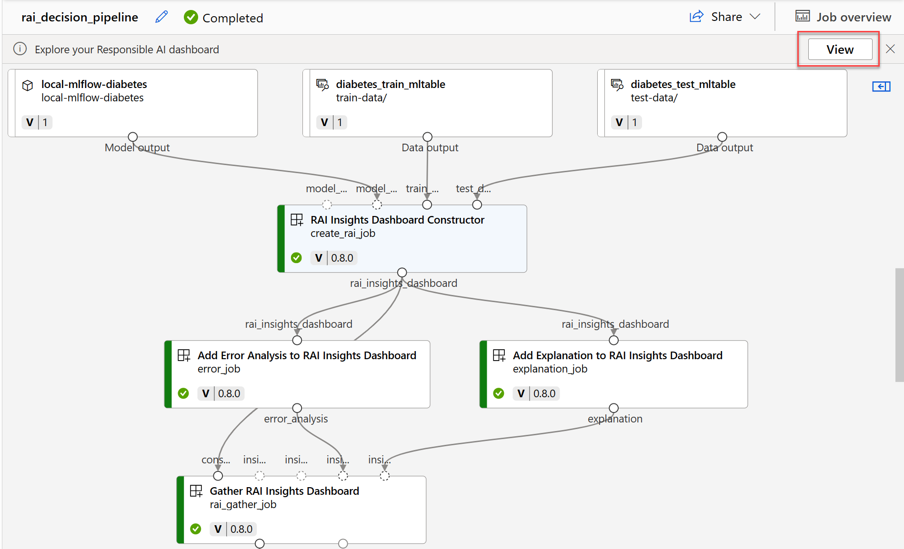

# Responsible AI Dashboard in Azure Machine Learning

Explore model explanations, error analysis, counterfactuals, and causal analysis by creating a Responsible AI dashboard. This guide covers creating and running the pipeline in Azure Machine Learning using the Python SDK v2 to generate the dashboard.

---

## Learning Objectives
- Understand Azure Machine Learning's built-in components for responsible AI.
- Create a Responsible AI dashboard.
- Explore a Responsible AI dashboard.

---

## Responsible AI Principles
Microsoft has defined five Responsible AI principles:

1. **Fairness and Inclusiveness**: Treat everyone fairly, avoiding bias.
2. **Reliability and Safety**: Ensure models are consistent and resilient.
3. **Privacy and Security**: Be transparent about data collection, usage, and storage.
4. **Transparency**: Explain how models make decisions.
5. **Accountability**: Maintain human control and take responsibility for decisions.

---

## Creating the Responsible AI Dashboard

The Responsible AI dashboard allows you to evaluate models based on safety, trustworthiness, and ethics. It includes:

- **Error analysis**: Understand model errors.
- **Explanations**: Analyze feature importance.
- **Counterfactuals**: Examine alternative inputs and outputs.
- **Causal analysis**: Explore feature effects on predictions.

### Pipeline Structure
1. **Start** with the RAI Insights dashboard constructor.
2. **Add** RAI tool components (e.g., explanations, causal analysis).
3. **End** with the Gather RAI Insights dashboard.
4. Optionally, add a scorecard generator.

---

## Using the Python SDK to Build the Pipeline

### Retrieve Components
```python
rai_constructor_component = ml_client_registry.components.get(
    name="microsoft_azureml_rai_tabular_insight_constructor", label="latest"
)

rai_explanation_component = ml_client_registry.components.get(
    name="microsoft_azureml_rai_tabular_explanation", label="latest"
)

rai_gather_component = ml_client_registry.components.get(
    name="microsoft_azureml_rai_tabular_insight_gather", label="latest"
)
```

### Build the Pipeline
```python
from azure.ai.ml import Input, dsl
from azure.ai.ml.constants import AssetTypes

@dsl.pipeline(
    compute="aml-cluster",
    experiment_name="Create RAI Dashboard",
)
def rai_decision_pipeline(target_column_name, train_data, test_data):
    create_rai_job = rai_constructor_component(
        title="RAI dashboard",
        task_type="classification",
        model_info=expected_model_id,
        model_input=Input(type=AssetTypes.MLFLOW_MODEL, path=azureml_model_id),
        train_dataset=train_data,
        test_dataset=test_data,
        target_column_name="Predictions",
    )

    explanation_job = rai_explanation_component(
        rai_insights_dashboard=create_rai_job.outputs.rai_insights_dashboard,
        comment="add explanation",
    )

    rai_gather_job = rai_gather_component(
        constructor=create_rai_job.outputs.rai_insights_dashboard,
        insight=explanation_job.outputs.explanation,
    )

    rai_gather_job.outputs.dashboard.mode = "upload"
    return {"dashboard": rai_gather_job.outputs.dashboard}
```

---

## Exploring the Dashboard

### Error Analysis
1. **Error Tree Map**: Identifies subgroups with high error rates.
2. **Error Heat Map**: Displays error distribution over one or two features.

### Explanations
1. **Aggregate Feature Importance**: Impact of each feature across the dataset.
2. **Individual Feature Importance**: Feature impact on specific predictions.

### Counterfactuals
Explore how alternative inputs affect model predictions.

### Causal Analysis
1. **Aggregate Causal Effects**: Average effect of features on predictions.
2. **Individual Causal Effects**: Feature influence on specific data points.
3. **Treatment Policy**: Identify data segments benefiting most from changes.

---

## Dashboard Generation
Run the pipeline to generate the Responsible AI dashboard. It can be accessed via the pipeline overview or the **Responsible AI** tab of the registered model in Azure Machine Learning Studio.




### Knowledge Check

1. A data scientist wants to investigate for which subgroups the model has relatively more false predictions, which Responsible AI component should be added to the pipeline to create the Responsible AI dashboard? 
        - [ ] Explanations.
        - [ ] Counterfactuals.
        - [ ] Error Analysis.

2. What should be the first component in a pipeline to create a Responsible AI Dashboard? 
        - [ ] RAI Insights dashboard constructor
        - [ ] Gather RAI Insights dashboard
        - [ ] Gather RAI Insights score card

3. A data scientist has trained a model, and wants to quantify the influence of each feature on a specific prediction. What kind of feature importance should the data scientist examine? 
        - [ ] Aggregate feature importance.
        - [ ] Individual feature importance.
        - [ ] Global feature importance.


## Ressources
- [ Responsible AI Standard](https://blogs.microsoft.com/wp-content/uploads/prod/sites/5/2022/06/Microsoft-Responsible-AI-Standard-v2-General-Requirements-3.pdf)